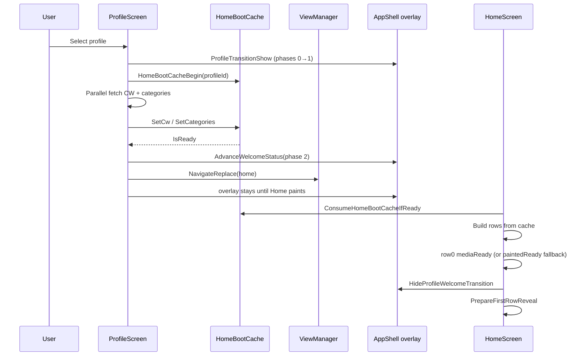

# OTT Accelerator — Roku Architecture

Production Roku channel (BrightScript + SceneGraph) porting the LG/Samsung CTV React app
(`/home/admin3329/Desktop/lg-samsung-tv-player`). Both clients talk to the same `media/v1/*` backend.

**Related docs:** [`docs/REACT_REFERENCE.md`](docs/REACT_REFERENCE.md) (React source path),
[`docs/REACT_PARITY_AUDIT.md`](docs/REACT_PARITY_AUDIT.md) (screen-by-screen gap analysis),
[`../docs/port-plan/port-plan.md`](../docs/port-plan/port-plan.md) (milestones),
[`../docs/roku-channel/roku-channel.md`](../docs/roku-channel/roku-channel.md) (tooling & install).

---

## Design principles

### 1. React is the reference

Behavior, API contracts, and visuals come from the React app at
`/home/admin3329/Desktop/lg-samsung-tv-player` first. When porting a screen,
start in `src/features/…` / `src/components/…`, then mirror routing, data shape, and UI
decisions in Roku.

### 2. Visual parity is literal

See `.cursor/rules/react-visual-parity.mdc`:

- Theme token in React → same token via `ThemeTokenColor` / `BuildThemeTokens`.
- Hardcoded color in React (`text-white`, `#2563eb`, Tailwind opacity) → same hex + alpha in Roku.
- No “close enough” substitutes (`neutral-50` for `text-white`, `CompositeOverBg`, etc.).

### 3. Thin routes, fat libraries

- **Screens** (`components/screens/`) own SceneGraph layout, focus, and lifecycle.
- **Widgets** (`components/widgets/`, `components/cards/`) are reusable row/card nodes.
- **Libraries** (`source/lib/`) hold HTTP, parsing, navigation payloads, and theme — no UI nodes.

This keeps `ViewManager` a pure router and lets services be tested/grepped independently.

### 4. Stack navigation with live instances

`ViewManager` maintains a screen stack. **Push** pauses the covered screen; **Pop** reveals the
instance beneath (hero timers resume). **Replace** tears down the outgoing screen and drains
pending HTTP so abandoned routes (e.g. Home mid-load → Movies) do not starve the new screen.

### 5. Dispose on teardown

Screens set `dispose = true` when removed. Observers, timers, and video nodes must stop in the
dispose handler so background hero trailers and prefetch jobs do not leak.

### 6. Config-driven layout

`ThemeConfig.brs` mirrors React `theme.config.ts`:

| React | Roku |
|-------|------|
| `homeLayout` | `ThemeHomeLayout()` |
| `headerStyle` | `ThemeHeaderStyle()` |
| `heroBannerStyle` | `ThemeHeroBannerStyle()` |

Profile avatar style follows **header style only** (Netflix = circular, Sidebar = square cards).

### 7. Verify with logs, not pixels

Instrument flows with grep-friendly tags (`[BROWSE_DBG]`, `ProfileSelectLog`, `[HTTP]`).
Run `make validate && make sim`, or **`make smoke`** for validate + deploy + telnet assertions.
Drive keys via `scripts/sim.py`, read telnet on port 8085.
Do not screenshot the simulator.

---

## Layer model

```
┌─────────────────────────────────────────────────────────────┐
│  AppShell (header, sidebar, profile welcome overlay)        │
│  ViewManager (stack, routes, home boot cache pointer)       │
├─────────────────────────────────────────────────────────────┤
│  Screens: Login, Profile, Home, Detail, Player, …           │
├─────────────────────────────────────────────────────────────┤
│  Widgets: ContentRow, Hero*, cards (Vertical, SeeAll, …)    │
├─────────────────────────────────────────────────────────────┤
│  source/lib: net, home, browse, video, profile, theme, reels│
└─────────────────────────────────────────────────────────────┘
                              │
                              ▼
                    media/v1/* REST API
```

**Key entry points**

| Area | Files |
|------|-------|
| Routing | `components/core/ViewManager.brs`, `source/lib/Routes.brs` |
| Shell / header | `components/core/AppShell.brs`, `components/widgets/HomeHeader.brs` |
| Home rows + See All tile | `components/widgets/ContentRow.brs`, `components/cards/SeeAllCard.*` |
| Card → route | `source/lib/home/HomeNav.brs`, `source/lib/browse/GenreNav.brs` |
| Player skip intro | `components/screens/VideoPlayerScreen.brs`, `source/lib/video/VideoService.brs` |
| Profile → Home boot | `ProfileScreen.brs`, `HomeBootCache.brs`, `ProfileTransition.brs` |

---

## Navigation

Routes are defined in `source/lib/nav/Routes.brs`. `CreateScreenForRoute` maps each route to a
screen component. Unknown routes fall through to a grey `CreatePlaceholderScreen` (only unused
legacy routes today).

### Screen inventory (shipped)

| Route | Screen | React reference |
|-------|--------|-----------------|
| `login` | `LoginScreen` | `features/login/` |
| `login_profile` | `ProfileScreen` | `features/profile/` |
| `home` | `HomeScreen` | `features/home/` |
| `detail` | `DetailScreen` | `features/contentdetail/` |
| `video_player` | `VideoPlayerScreen` | `features/contentdetail/video/` |
| `series_episodes` | `SeriesEpisodesScreen` | series episode picker |
| `genere` | `GenreListScreen` | `features/genre-list/` |
| `series`, `new_release` | `SeriesScreen` | `features/series/` (See All grid) |
| `search` | `SearchScreen` | `features/search/` |
| `mylist_detail` | `MyListDetailScreen` | watchlist folder grid |
| `reels` | `ReelsScreen` | reels vertical feed |

**Milestone status:** M0–M4 complete. M5 (ads) not started. M6 polish/QA in progress.

---

## Profile → Home boot flow

Goal: hide the jarring flash of an empty Home while CW + category APIs load after profile select.



**Rules**

- No artificial dwell timers — navigate as soon as cache is ready.
- Overlay dismiss is tied to **row 0 `mediaReady`** (first row thumbnails loaded), with
  `paintedReady` as fallback.
- 15s safety timer on Profile still forces navigation if APIs hang.
- `HomeBootCache` lives on `ViewManager`; cleared on logout / `NavigateClearAndReplace`.

---

## See All flow

React shows a **See All** card when a row has more than `SEE_ALL_LENGTH` (10) items.
Roku mirrors this with `HC_SeeAllThreshold()` and `SeeAllCard` appended as the last tile in
`ContentRow`.

| Source | Handler | Destination |
|--------|---------|-------------|
| Home row | `HomeNavPayloadForCard` → `RouteSeries()` | `SeriesScreen` with `categoryId`, `genere_title`, `type` |
| Genre list row | `GenreNavPayloadForCard` → `RouteSeries()` | `SeriesScreen` with `genere_id`, `genere_title`, `type` |

`SeriesScreen` fetches paginated catalogue (`limit=27`), 6 cards per row — parity with
`src/features/series/`.

**Verification checklist**

- [ ] Home row with 11+ items shows See All tile at end
- [ ] OK on See All → `SeriesScreen` title matches category name
- [ ] Grid loads, pagination on DOWN at last row
- [ ] Card select → `DetailScreen`
- [ ] Genre list See All → same `SeriesScreen` with `genere_id` filter
- [ ] Logs: `BrowseDbg series_nav`, `[HTTP]` catalogue request

---

## Skip Intro (video player)

React `features/contentdetail/video/index.tsx` shows a **Skip Intro** pill while playback
position is within `[skipStart, skipEnd]` from content detail.

Roku:

- `VideoIntroStart` / `VideoIntroEnd` read `detail.skipStart` / `detail.skipEnd`
  (`VideoService.brs`).
- `EvaluateSkipIntro()` toggles `skipIntroBtn` visibility on each position tick.
- `DoSkipIntro()` seeks to `introEnd + 1` (same as React).
- Focus moves to skip pill when visible; OK triggers skip.

**Verification checklist**

- [ ] Play content that has `skipStart` / `skipEnd` in API detail
- [ ] Pill appears during intro window, hides after
- [ ] OK skips to post-intro position
- [ ] Focus highlight uses `primary-500` when focused
- [ ] Logs: position ticks, seek after skip

---

## HTTP & config

- `config.json` (from `config.example.json`): API base URL, `businessDomain`, auth.
- `Config.brs` + global `businessResolved` gate screens that need tenant theme/menu.
- Shared HTTP pool in `source/lib/net/`; navigation teardown calls `DrainHttpQueueForNavigation`.

---

## Improvement backlog

**Active plan:** [`../docs/m6-architect-review-and-plan.md`](../docs/m6-architect-review-and-plan.md) — phased refactor on `feature/m6-refactor` from `dev` (replaces `feature/m6-polish`).

| Item | Rationale |
|------|-----------|
| Phase A–C | Shared libs + slim `HomeScreen` / grid screens — **Phase C done** on `feature/m6-refactor-phase-c` |
| Structured `[BOOT]` timeline logs | Easier profile→home regression triage |
| Update `port-plan.md` Reels row | Docs still say placeholder; `ReelsScreen` is shipped |
| M5 Ads | Only major feature area not ported |
| See All + Skip Intro QA | Implemented; needs log-verified pass (above) |
| Cert / device QA (M6) | Real-hardware focus maps, memory, deep link |

---

## Quick commands

```bash
make validate          # compile + lint
make sim               # BrightScript Simulator
make smoke             # validate + sim + scripts/smoke.sh (Phase F)
scripts/sim.py key OK  # inject remote key
scripts/sim.py log     # tail telnet debug (port 8085)
```
